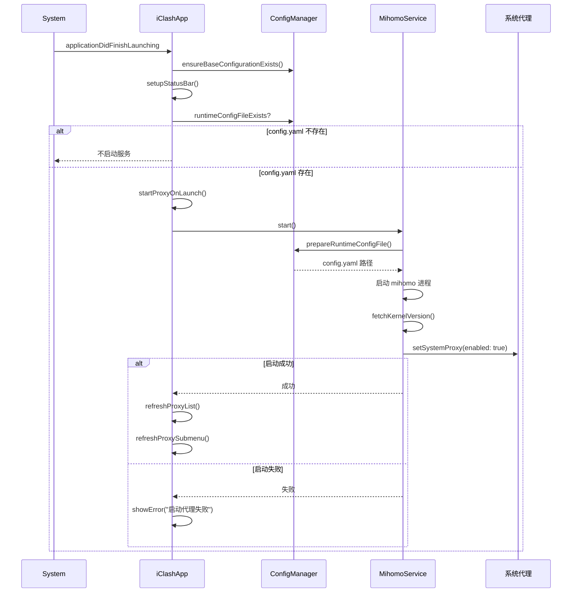
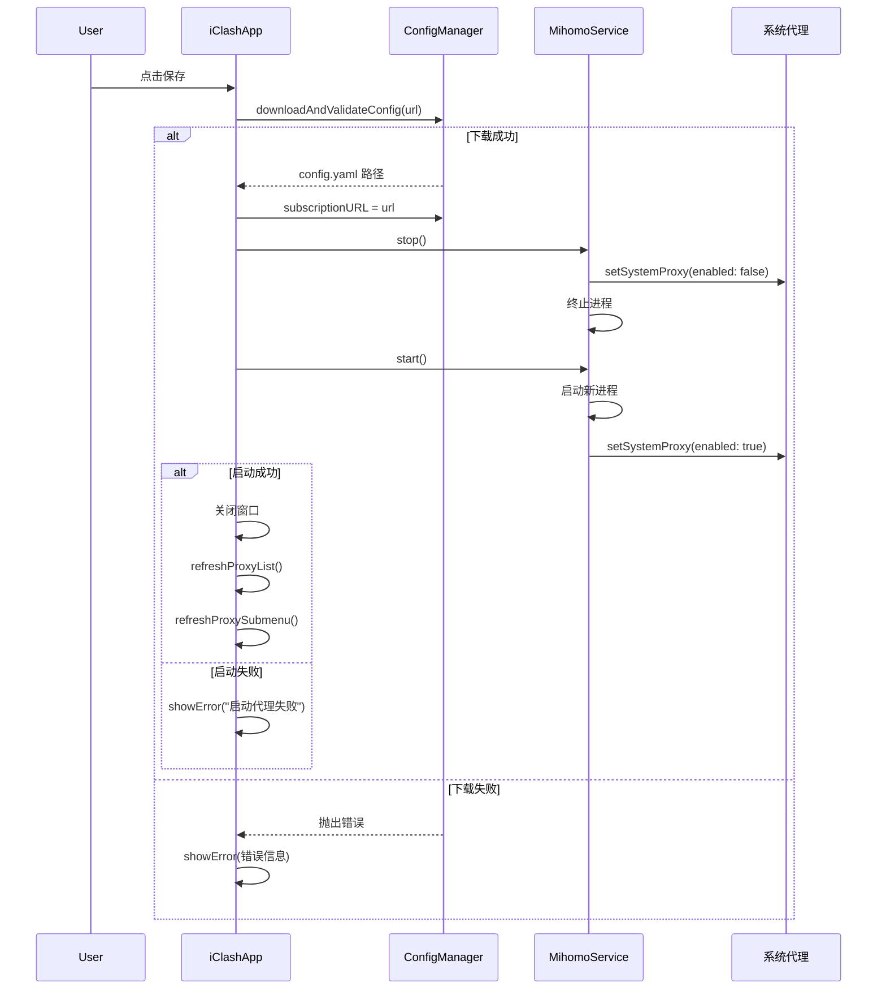
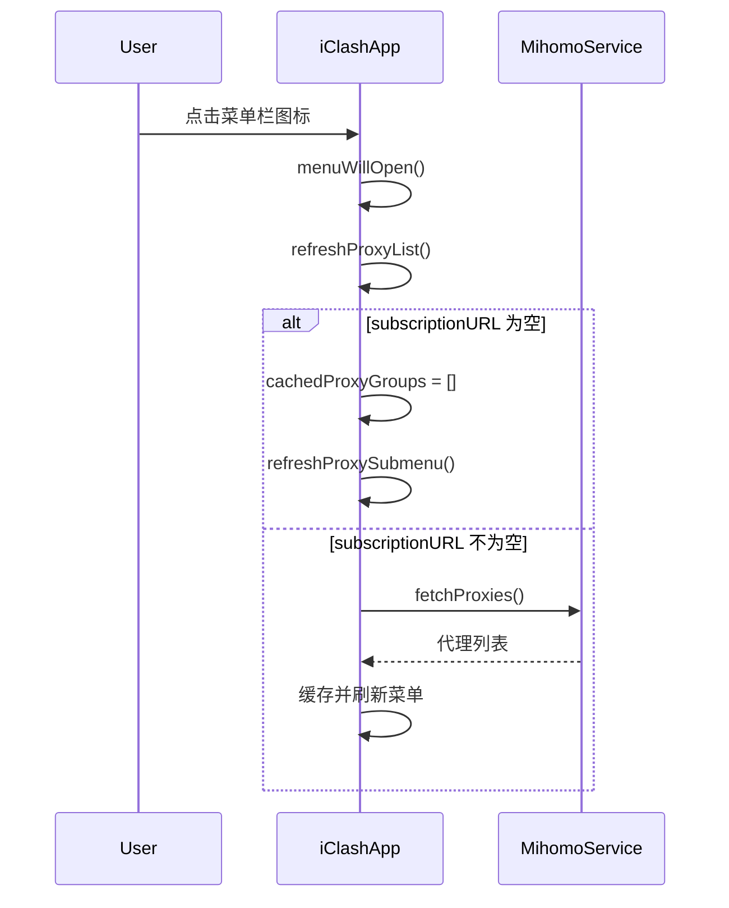
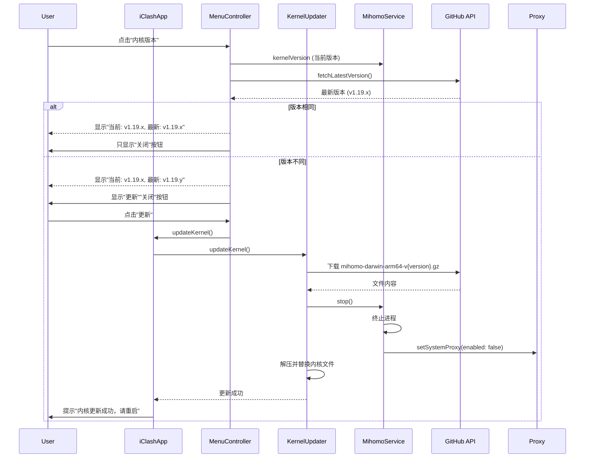
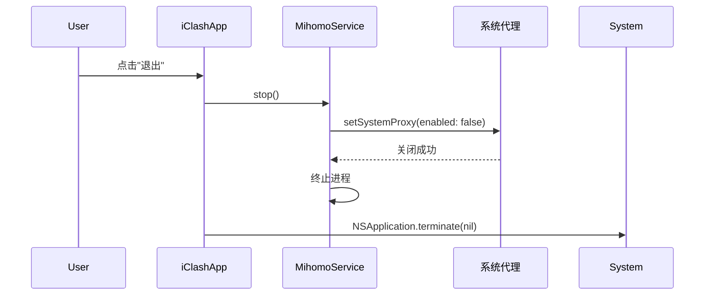

# iClash 流程时序图

## 1. APP 启动流程

## 2. 保存 URL 流程

## 3. 点击菜单栏流程

## 4. 内核版本更新流程

## 5. 退出应用流程

## 核心逻辑总结

| 场景 | 行为 |
|------|------|
| 启动 APP | config.yaml 存在 → 启服务；不存在 → 不启动 |
| 保存 URL | 下载成功 → 保存 URL → 停服务 → 启服务 → 关窗口 → 刷新菜单 |
| 保存 URL | 下载失败 → 提示错误，窗口保持，不保存 URL，无其他动作 |
| 点击菜单栏 | 每次点击 → 刷新代理列表 |
| 点击"内核版本" | 显示当前和最新内核版本，版本不同时提供更新按钮 |
| 点击"退出" | 关闭系统代理 → 终止 mihomo 进程 → 退出应用 |
